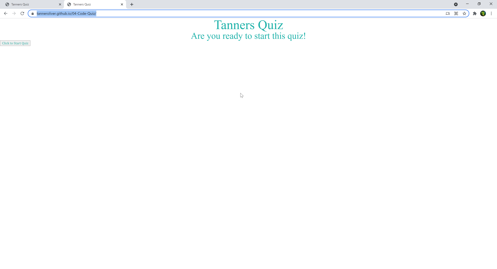
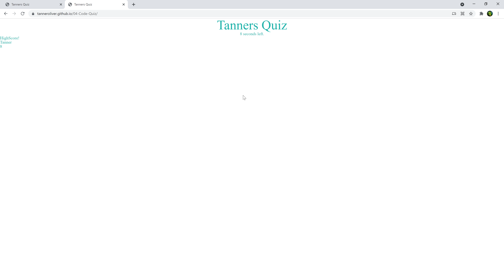

# Hw04-Code-Quiz
## Objective
In this homework I built a quiz. When I click the start button it will display the first question and start the time. Every time I click on an answer it will check the answer and console.log if it is right or wrong. When I have gotten to the end it displays a page with the highscore from the localStorage.
## Screenshot

## Deployed Page
https://tanneroliver.github.io/04-Code-Quiz/